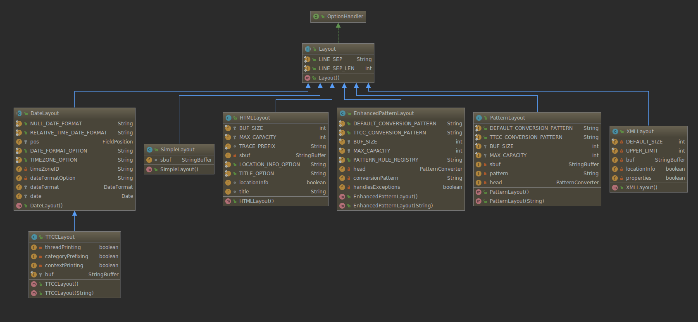

# log4j-practices
log4j practices demo

REFERENCE : https://howtodoinjava.com/log4j/

## 日志等级

> Order: ALL < TRACE < DEBUG < INFO < WARN < ERROR < FATAL < OFF

日志等级对应图

## 日志格式化

所有的布局对象 - `Appender`对象收到 `LoggingEvent` 对象。

布局对象检索来自`LoggingEvent` 的消息参数，并应用适当的 `ObjectRenderer` 获得消息的字符串表示。

### PatternLayout 

PatternLayout is also a simple Layout object that provides the following-Bean Property which can be set using the configuration file:

|   S.N.     | Property & Description  |  
| --------   | -----:  | 
| 1     | `conversionPattern` Set the conversion pattern. Default is `%r [%t] %p %c %x - %m%n`|   
 
#### Pattern Conversion Characters

The following table explains the characters used in the above pattern and all other characters that you can use in your custom pattern:

|   Conversion Character     | Meaning  |  
| --------   | :-----  | 
| c     | 用于输出的记录事件的类别(`category`). 例如，对于类别名称"a.b.c" 模式  %c{2} 会输出 "b.c" |
| C     | 用于输出呼叫者(`caller`)发出日志请求的完全限定类名(`fully qualified class`). 例如，对于类名 "org.apache.xyz.SomeClass", 模式 %C{1} 会输出 "SomeClass". |
| d     | 用于输出的记录事件的日期. 例如， %d{HH:mm:ss,SSS} 或 %d{dd MMM yyyy HH:mm:ss,SSS} |
| F     | 用于输出被发出日志记录请求，其中的文件名 |
| I     | 用于将产生的日志事件调用者输出位置信息 |
| L     | 用于输出从被发出日志记录请求的行号 |
| m     | 用于输出使用日志事件相关联的应用程序提供的消息 |
| M     | 用于输出发出日志请求所在的方法名称 |
| n     | 输出平台相关的行分隔符或文字 |
| p     | 用于输出的记录事件的优先级(`priority`) |
| r     | 用于输出毫秒级别从布局的结构经过直到创建日志记录事件的数目 |
| t     | 用于输出生成的日志记录事件的线程的名称 |  
| x     | 用于与产生该日志事件的线程相关联输出的NDC（嵌套诊断上下文） |
| X     | 在X转换字符后面是键为的MDC。 例如  X{clientIP} 将打印存储在MDC对键clientIP的信息 |
| %     | 文字百分号 %%将打印％标志 | 

#### Format Modifiers    

By default, the relevant information is displayed as output as is. 

However, with the aid of format modifiers, it is possible to change the minimum field width, the maximum field width, and justification.

Following table covers various modifiers scenarios:

|   Format Modifier     | Left Justify  |   Minimum Width  |Maximum Width| Note|
| --------   | :-----  | :-----  |  :-----  | :----|
| %20c  | false  | 20  |  none  | 用空格左垫，如果类别名称少于20个字符长|
| %-20c  | true  | 20  |  none  | 用空格右垫，如果类别名称少于20个字符长|
| %.30c  | NA  | none  |  30  | 从开始截断，如果类别名称超过30个字符长|
| %20.30c  | false  | 20  |  30  | 用空格左侧垫，如果类别名称短于20个字符。 但是，如果类别名称长度超过30个字符，那么从开始截断。|
| %-20.30c  | true  | 20  |  30  | 用空格右侧垫，如果类别名称短于20个字符。 但是，如果类别名称长度超过30个字符，那么从开始截断。|